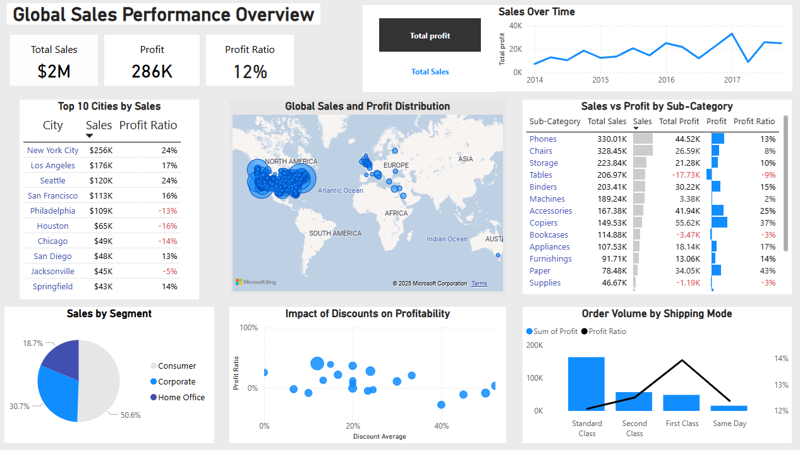

Global Sales Performance Dashboard

This Power BI dashboard provides an interactive overview of global sales performance, allowing users to analyze revenue, profitability, discounts, and customer segmentation. The dashboard is based on the Sample Superstore dataset and demonstrates advanced data modeling, visualization, and business insights.

** Key Features

KPI Cards - Highlighting Total Sales, Profit, and Profit Ratio.

Sales Over Time - Line chart tracking sales and profit trends across years.

Sales by Cities (Top 10) - Ranking cities by revenue and profitability.

Global Sales & Profit Distribution - Map visualization showing geographical distribution of performance.

Sales vs Profit by Sub-Category - Comparing revenue, profit, and profit ratio across product categories.

Impact of Discounts on Profitability - Scatter plot analyzing the relationship between discounts and margins.

Order Volume by Shipping Mode - Combo chart displaying both order volume and profit ratio by shipping methods.

Sales by Segment - Pie chart illustrating contribution of Consumer, Corporate, and Home Office segments.

🎯 Insights Gained

The majority of sales are concentrated in North America and Western Europe.

High discounts often reduce profit margins significantly, even when sales volume increases.

Standard Class shipping generates the highest order volume, but other modes vary in profitability.

Top cities such as New York and Los Angeles drive the highest sales, yet profitability varies significantly, with some cities generating losses despite strong revenue.

The Consumer segment is the largest contributor to overall sales.

Sales over time reveal fluctuations rather than steady growth, highlighting the need for strategies that drive sustainable, long-term revenue increases instead of short-term spikes.

⚙️ Technical Highlights

Built in Power BI Desktop using the Sample Superstore dataset.

Implemented calculated measures & parameters (Profit, Sales, Profit Ratio, Metric Selector).

Applied DAX calculations for KPIs and performance metrics.

Used Conditional Formatting and Combo Charts for enhanced analytical depth.

Optimized layout with consistent design and readability for business stakeholders.

